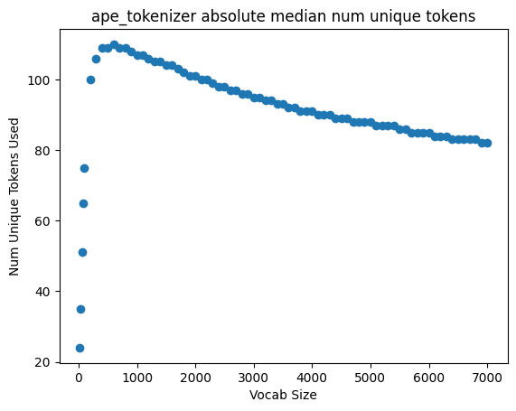
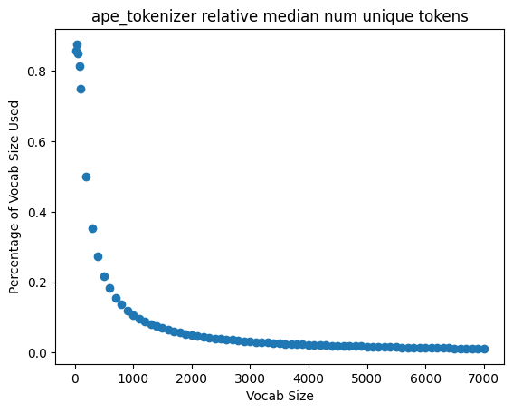
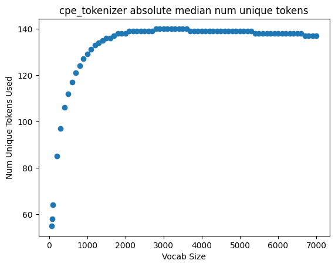
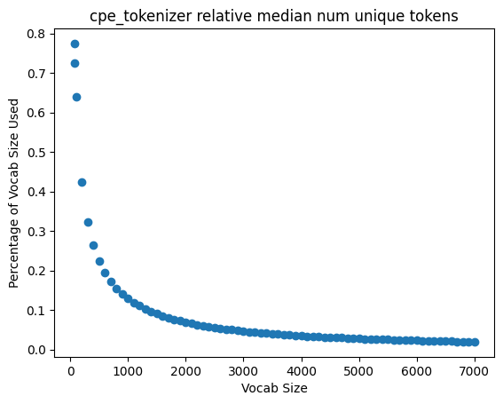
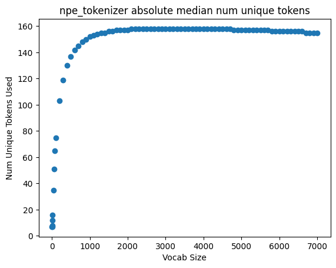
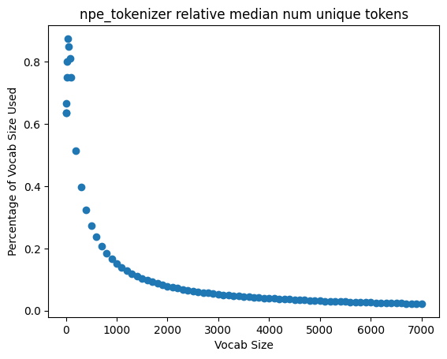

# How does byte-pair encoding work?

The Byte Pair Encoding (BPE) algorithm is a compression technique commonly used in natural language processing to create subword tokenizers. The algorithm begins with an initialization of the vocabulary, where each unique symbol (character or byte) in the training corpus is considered a separate token. Through iterative merges of the most frequently occurring symbol pairs, the vocabulary is updated to create new, compound symbols. This process continues until a predefined vocabulary size is reached, enabling the capture of recurring subword patterns and improving the model's ability to represent complex linguistic structures in its tokenization.

Here's a great example of how the BPE algorithm works:

In the realm of genetic code analysis, BPE provides a valuable tool for creating tokenizers that capture local sequence motifs. Applied to DNA, protein, and codon sequences, the algorithm starts with an initial vocabulary of individual nucleotides, amino acids, or "codon characters". By merging frequently occurring pairs, the algorithm adapts to recognize common subword sequences within the genetic data. This subword tokenization allows for a more nuanced representation of genetic information, aiding language models in understanding the intricacies of biological sequences and uncovering meaningful patterns in the underlying genetic code.

More specifically, we coin 3 tokenizers:
1. APE Tokenizer: trained on amino acid sequence
2. CPE Tokenizer: trained on codons that have been translated to other characters (each token can only be 1 character at the start)
3. NPE Tokenizer: trained on raw nucleotide sequences

A crucial aspect of the algorithm is the vocab size, as it directly influences the granularity of the tokenization process. A larger vocabulary size allows the algorithm to capture finer details and more specific subword patterns, but it also increases the chances of overfitting the tokenizer to the training corpus data. Balancing the vocabulary size is essential to ensure that the tokenizer strikes a suitable trade-off between granularity and balanced fitting, enabling the model to effectively represent the inherent structures and motifs present in the genetic sequences.

Running some experiments, we generated the following plots for each of the 3 tokenizers: 

&nbsp;&nbsp;a. We determine the median number of unique tokens used at each vocab size - the mean number produced notably skewed data.

&nbsp;&nbsp;b. We also calculate the percentage of the vocab size that is used in the training corpus by dividing the median number of unique tokens by the vocab size

The following are results from the MDH Natural Dataset:

## APE Experiments
> 1a. APE Median Number of unique tokens
>> 

> 1b. APE percentage of vocabulary used
>> 

## CPE Experiments
> 2a. CPE Median Number of unique tokens
>> 

> 2b. CPE percentage of vocabulary used
>> 

## NPE Experiments
> 3a. NPE Median Number of unique tokens
>> 

> 3b. NPE percentage of vocabulary used
>> 